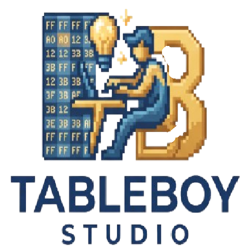

<p align="center">
  
</p>

<h1 align="center">TableBoy Studio</h1>

<p align="center">
  Editor desktop moderno de tabelas de caracteres <code>.tbl</code> para ROM hacking.
</p>

<p align="center">
  <strong>Electron · React · TypeScript · Vite</strong>
</p>

## Sobre o projeto

O TableBoy Studio permite criar, abrir, editar, validar e salvar tabelas que
associam bytes a caracteres, textos ou tokens especiais. O editor visual usa uma
matriz hexadecimal 16×16, na qual cada célula representa um byte entre <code>00</code> e
<code>FF</code>.

O projeto é inspirado conceitualmente no Table Manager 1.0 de Hyllian, mas possui
implementação própria, interface original e arquitetura moderna.

## Recursos do MVP

- matriz hexadecimal 16×16 editável;
- criação, abertura, salvamento e Save As de arquivos <code>.tbl</code>;
- Drag & Drop de arquivos <code>.tbl</code>;
- suporte a Unicode, strings e tokens como <code>[PLAYER]</code>, <code>[LINE]</code> e <code>[END]</code>;
- edição direta pela matriz ou pelo Character Inspector;
- catálogo de caracteres PT-BR, Romaji, Hiragana e Katakana;
- preenchimento sequencial de <code>A-Z</code>, <code>a-z</code> e <code>0-9</code>;
- validação de linhas inválidas e chaves duplicadas;
- histórico Undo/Redo;
- busca por byte hexadecimal ou valor;
- proteção contra perda de alterações em New, Open, Exit e fechamento da janela;
- menus File, Edit, Table, Encoding, Tools, View e Help;
- interface isolada do filesystem por preload, <code>contextBridge</code> e IPC tipado.

## Formato <code>.tbl</code>

Cada linha associa uma chave hexadecimal a um valor:

```text
41=A
42=B
43=C
F1=Ã
F2=Õ
F4=ã
F5=õ
```

Também podem existir tokens e sequências:

```text
F001=[PLAYER]
F002=[RIVAL]
```

O core aceita chaves de tamanho variável, mantém caracteres Unicode e reconhece
comentários iniciados por <code>#</code>, <code>;</code> ou <code>//</code>. O editor visual atual trabalha
somente no modo 8-bit (<code>00</code>–<code>FF</code>).

## Arquitetura

A lógica de tabelas é independente do Electron e do React:

```text
src/
├── core/
│   ├── characters/      # Catálogos e sequências de caracteres
│   └── table/           # Parser, writer, validator e modelo
├── main/
│   └── ipc/             # Diálogos e acesso seguro ao filesystem
├── preload/             # API mínima exposta pelo contextBridge
├── renderer/
│   └── src/
│       ├── components/  # Interface React reutilizável
│       ├── services/    # Integração entre documentos e core
│       └── state/       # Estado e histórico do editor
└── shared/              # Contratos compartilhados de IPC
```

Fluxo de arquivos:

```text
Renderer → Preload/contextBridge → IPC → Main Process → Filesystem
```

As configurações Electron mantêm <code>contextIsolation: true</code> e
<code>nodeIntegration: false</code>. O renderer não recebe acesso direto ao Node.js,
filesystem ou <code>ipcRenderer</code>.

## Atalhos

| Ação                      | Atalho                    |
| ------------------------- | ------------------------- |
| Nova tabela               | <code>Ctrl+N</code>       |
| Abrir tabela              | <code>Ctrl+O</code>       |
| Salvar                    | <code>Ctrl+S</code>       |
| Salvar como               | <code>Ctrl+Shift+S</code> |
| Desfazer                  | <code>Ctrl+Z</code>       |
| Refazer                   | <code>Ctrl+Y</code>       |
| Buscar                    | <code>Ctrl+F</code>       |
| Limpar célula selecionada | <code>Delete</code>       |
| Exibir atalhos            | <code>F1</code>           |

## Desenvolvimento

### Requisitos

- Node.js;
- npm;
- Windows, macOS ou Linux.

### Instalação

```bash
git clone https://github.com/lucasineth/TableBoy-studio.git
cd TableBoy-studio
npm install
npm run dev
```

### Validação

```bash
npm run typecheck
npm run lint
npm test
npm run build
```

### Empacotamento

```bash
npm run build:unpack
npm run build:win
npm run build:mac
npm run build:linux
```

Os artefatos são gerados em <code>dist/</code>.

## Roadmap

- editor visual para tabelas 16-bit;
- conversões OEM/ANSI e Windows-1252;
- suporte dedicado a Shift-JIS;
- ROM viewer e busca de textos em binários;
- codificação e decodificação usando tabelas;
- presets personalizados;
- ferramentas para fontes e glyphs.

Esses recursos não fazem parte do MVP atual.

## Créditos

**Developed by Lucas Ineth**  
© 2026 Lucas Ineth  
Built for ROM hackers & retro enthusiasts.
